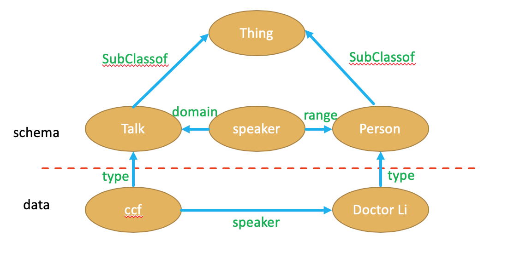

知识表示与知识建模
====

一、知识简介
-------

#### 1. 知识表示的重要性
- 知识是智能基础
    
    - 机器可以或得知识
    - 机器可以运用知识

- 符合计算机要求的知识模式

    - 计算机可以存储、处理的知识表示模式
    - 数据结构
    - 知识与数据的不同在于：知识可以比数据提供更强大的推理能力
    
#### 2. 知识的特性
- 相对正确性
    
    - 在一定条件下/某种环境下
- 不确定性
    
    - 存在"中间状态"
    - "真"/"假"的程度
    - 随机性
    - 模糊性
    - 经验性
    - 不完全性
- 可表示性和可利用性（知识载体）

    - 语言文字
    - 图形图像
    - 视频音频
    - 神经网络
    - 概率图模型         
    
#### 3. 知识分类
- 常识性知识（鱼是动物）、领域性知识（金融、电信.....）
- 事实性知识（灰太狼吃不到喜羊羊）、过程性知识（如何进行知识建模）、控制知识（程序判断条件）
- 确定性知识、不确定性知识
- 逻辑性知识、形象知识
    
### 4. 早期知识表示方法
- 一阶谓词逻辑（表达能力强、复杂度高-断言）First-Order Logic
- 产生式规则（专家系统产生-命题（if-then））
- 框架（描述事件等复杂对象）
- 语义网络（对应与NLP产生）
- 逻辑程序
- 缺省逻辑
- 模态逻辑

二、 基于语义网的知识表示
-----
#### RDF
- Resource：页面、图片、视频等任何具有URI标示符的资源
- Description：属性、特征和资源之间的关系
- Framework：模型、语言、描述的语法

三元组（Triple）形式来组织知识  
（Subject，Predicate，Object）  
> eg:    CCF邀请李老师作为讲者，讲授NLP  
> (CCF，speaker，Doctor Li)  
> (CCF,theme,NLP)

用URI缩写表示
> (ex:ccf,ex-schema:speaker,ex:Doctor Li)  
> (ex:ccf,ex-schema:theme,ex:NLP)

字面量(literals)  
NLP是一个字符串，它就是一个字面量
> (ex:ccf,ex-schema:speaker,ex:Doctor Li)  
> (ex:ccf,ex-schema:theme,ex:"NLP"^^xsd:string)

空白节点（Blank Node）  
表示一些更复杂关系（超过二元关系）  
RDF允许空白节点，一个资源可以是匿名的（标示为_：xxx）
>eg:李老师是某一次NLP讲座的讲者
> (\_:x,ex-schema:speaker,ex:Doctor Li)  
> (\_:x,ex-schema:theme,ex:"NLP"^^xsd:string)

#### RDF的几种序列化方法
- RDF/XML
    > <rdf:RDF xmlns:ex-schema=http://ex.org/schema#>  
    &nbsp;&nbsp;&nbsp;  <rdf:Description rdf:about="http://ex.org/ccf">  
    &nbsp;&nbsp;&nbsp;&nbsp;&nbsp;&nbsp;  <ex-schema:speaker rdf:resource="http://ex.org/DoctorLi"/>   
    &nbsp;&nbsp;&nbsp;&nbsp;&nbsp;&nbsp;  <ex-schema:theme rdf:resource="http://ex.org/NLP"/>   
    &nbsp;&nbsp;&nbsp;  </rdf:Description>  
    </rdf:RDF>

- N-Triples(XML简化版)
    > \<http://ex.org/ccf>  
    &nbsp;&nbsp;&nbsp;\<http://ex.org/schema#speaker>  
    &nbsp;&nbsp;&nbsp;\<http://ex.org/DoctorLi>   
    > 
    > \<http://ex.org/ccf>   
    &nbsp;&nbsp;&nbsp;\<http://ex.org/schema#theme>   
    &nbsp;&nbsp;&nbsp;\<http://ex.org/NLP">
    
- Turtle（N-Triples简化版）
    > @prefix:ex:\<http://ex.org>  
    @prefix:ex-schema:\<http://ex.org/schema>  
     &nbsp;&nbsp;ex:ccf  
     &nbsp;&nbsp;ex-schema:speaker ex:DoctorLi  
     &nbsp;&nbsp;ex-schema:theme ex:NLP

- RDFa（用于网页的语义表示）
- N-Quads(四元组（比三元组多了组号）)
- TriG（Turtle扩展版）
- JSON-LD

封闭世界假设：没有定义的代表不存在（数据库假设）   
开放世界假设：没有定义的代表我不知道 （知识图谱假设） 
> (ex:ccf,ex-schema:speaker,ex:Doctor Li)  
> 表示ccf讲座 _至少有一位_ Doctor Li的讲者

#### 分布式定义知识
> (ex:ccf,ex-schema:speaker,ex:Doctor Li)  发布在CCF上
> (ex:lionztt,ex-schema:knows,ex:Doctor Li) （lionztt认识Doctor Li）发布在 lionztt 网站上

两者可以自动合并（知识融合）
> (ex:ccf,ex-schema:speaker,ex:Doctor Li)   
> (ex:lionztt,ex-schema:knows,ex:Doctor Li)

#### 带标注的RDF:annotated RDF
扩展RDF表达更多信息  
- 时间(信息可能会过时)
- 空间
- 来源
- 信任
- ....

采用带标注的RDF的知识库：YAGO2
语法形式：（S，P，O）：ג
> ג是一个标志  
eg:(奥巴马，就职，总统)：2008年

#### RDFS：RDF Schema 
RDFS在RDF基础上提供了一个基本类型系统，类别上下级关系，属性间上级关系（eg：定义了类与子类）  

- 对于RDF来说只有data层，RDFS加入schema层，data层是schema层的实例 
- Talk主，Speaker谓，Person宾
- 圆圈中除了Speaker是属性外，其余都是资源
 
RDFS预定义词汇：
- Class：定义类
- SubClassOf：定义子类
- type：定义实例关系
- property：定义属性
- subPropertyOf：描述该属性的父属性
- domain：表示该属性属于哪个类别
- range：描述该属性的取值类型

RDFS推理示例：
> 谷歌 rdf:type 人工智能公司  
人工智能公司 rdfs：SubClassOf 高科技公司  

推出
>谷歌 rdf:type 高科技公司 

推理可以看作一种智能的知识压缩

#### OWL
RDFS不能表达复杂类，及类上的约束  
OWL（本体语言）是RDFS的一个扩展补充了类的约束  
OWL三个子语言：
OWL FULL > OWL DL > OWL Lite  
OWL预定义词汇：  
- 等价性声明：
    - equivalentClass: 类相同
    - equivalentProperty：属性相同
    - sameIndividualAs: 实例相同
    > ex:运动员 owl：equivalentClass ex：体育选手  
    ex:获得 owl：equivalentProperty ex：取得  
    ex:运动员A owl：sameIndividualAs ex：小明

- 属性传递性声明：
    - TransitiveProperty： 传递性属性
    > ex:祖先 rdf:type owl:TransitiveProperty
    
    则我们可以有
    > ex:小明 ex:祖先 ex:小王； ex:小王 ex:祖先 ex:小帅
    
    推出
    > ex:小明 ex:祖先 ex:小帅
    
- 互斥性声明：（两个属性相反）  
    - inverseOf：属性相反
    > ex:祖先 owl:inverseOf ex:非祖先
    
    则我们可以有
    > ex:小明 ex:祖先 ex:小王
    
    推出
    > ex:小王 ex:非祖先 ex:小明
    
- 属性函数性声明：
    - FunctionalProperty：声明属性表示唯一
    > ex:hasMom rdf:type owl:FunctionalProperty   
    每个人只有一个母亲

- 属性对称性声明：
    - SymmetricProperty：对称性属性
    > ex:friend rdf:type owl:SymmetricProperty  
         
    则我们可以有
    > ex:小明 ex:friend ex:小王
    
    推出
    > ex:小王 ex:friend ex:小明

- ......

Notice：ex是命名空间简称
#### OWL2
对OWL进行语法约束，使得推理过程变得更方便，效率更高

OWL2查询：
- OWL2 QL：适用实例层较大
- OWL2 EL：适用概念层较大（类如专业领域：医疗）

#### 总结
RDF-》RDFS-》OWL都是在概念层逐渐丰富以创造一个更复杂的本体

三、知识查询
-----
#### SPARQL：Protocol and RDF Query Language
- RDF查询语言
- 可以对不同数据集编写复杂的连接（join）
- 由所有主流图数据库支持

          

